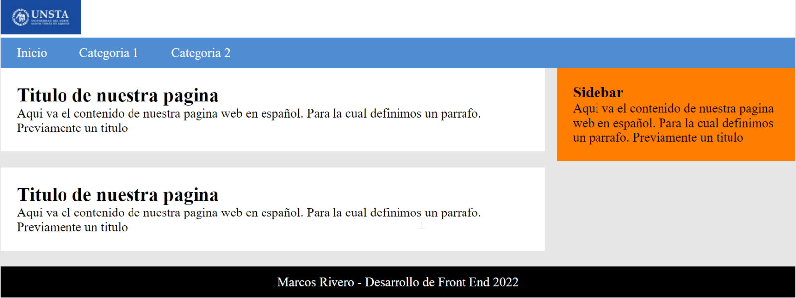

# Desarrollo de Front End - 2025

## _Universidad del Norte Santo Tomas de Aquino_

### ~~Trabajos Practicos~~

## Primer Trabajo Practico

**HTML**

1. Diseñar una página HTML y definir su estructura general
2. Diseñar una página HTML y definir su estructura general, agregar título y párrafo
3. Diseñar una página HTML y definir su estructura general

   - Agregar un Título (para la pestaña del navegador)
   - Incluir una foto cualquiera (por el momento posicionarla en cualquier lugar de la pantalla)
   - Agregar una tabla y completarla con información ficticia.
   - Los textos de la primera columna deben ir en **negrita**

4. Diseñar una lista no ordenada de lenguajes de programación, luego anidar con una lista ordenada.

## Segundo Trabajo Practico

**HTML AND CSS**

1. Diseñar el siguiente sitio web

- Algunas consideraciones:
  - Cuando hago el hover de algún elemento del menú el background de este debería mostrarse en un azul más tenue/claro.
  - Respetar márgenes entre las secciones.
  - El footer debe estar centrado.

## Tercer Trabajo Practico

**HTML AND JAVASCRIPT**

1. Pedir la edad y si es mayor a 18 indicar que puede conducir.

2. Pedir una nota y mostrar la calificación según la nota:

- 0-3: Muy deficiente
- 3-5: Insuficiente
- 5-6: Suficiente
- 6-7: Bien
- 7-9: Notable
- 9-10: Sobresaliente

3. Calcular y mostrar los números primos del 1 al 100 usando un ciclo for y un array de números enteros.

4. Realiza una página que muestre cinco cuadrados de diferentes colores. Cuando el mouse pase por encima de alguno de ellos el color de fondo de todo el sitio web será del color de relleno del cuadrado.

5. Desarrollar un formulario (Nombre - Apellido - Sexo - Edad) y validar todos sus campos

- Además:
  - Si es Hombre y mayor a 65 entonces mostrar un mensaje indicando que puede jubilarse
  - Si es mujer y mayor a 60 entonces mostrar un mensaje indicando que puede jubilarse
